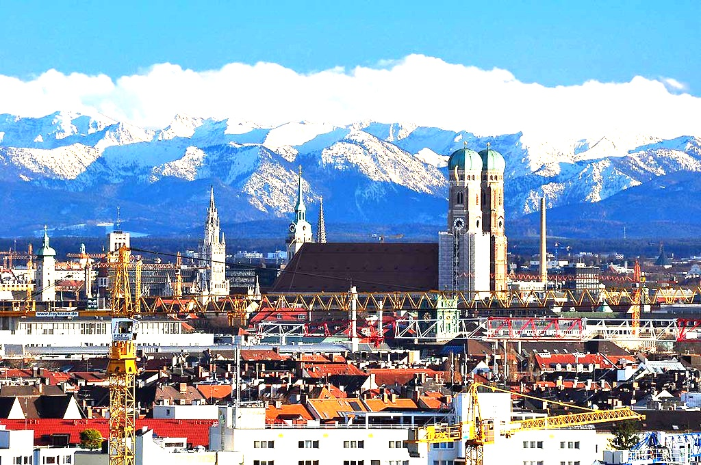

# 52: Image Filter Program
This C++ program allows you to apply various image filters to an input picture. The supported filters include inversion, brightness adjustment, contrast adjustment, grayscale conversion, fuzzy/gaussian filter, edge detection and sharpening.
### Table of Contents

- [52: Image Filter Program](#52-image-filter-program)
  - [Prerequisites](#prerequisites)
    - [Install OpenCV on Ubuntu/Linux](#install-opencv-on-ubuntulinux)
    - [Install OpenCV on Windows](#install-opencv-on-windows)
  - [Getting Started](#getting-started)
    - [Run the Software](#run-the-software)
    - [First Steps](#first-steps)
  - [Filter](#filter)


## Prerequisites

Before running the program, ensure that you have OpenCV installed on your system. Even thoug the software not uses OpenCV to convert the images, we need OpenCV to load and to display the images. Follow the instructions below to install OpenCV.

### Install OpenCV on Ubuntu/Linux

``` bash
sudo apt-get update
sudo apt-get install libopencv-dev
```

### Install OpenCV on Windows
Follow the instructions on the [OpenCV official website](https://docs.opencv.org/master/d3/d52/tutorial_windows_install.html)


## Getting started

### Run the software

First navigate into the project folder where the Cmake file is located. Here run the follwig lines in the terminal to buid an executable file:

``` bash
cmake .
make
```
Then run the software with the follwing command:

``` bash
./52 <name (and location) of your image file>
```

### First steps

Now you have to type a charcter to apply the respective filte to the image. following options are allowed:

- **Invert (i):** Inverts the colors of the image.
- **Brightness (b):** Adjusts the brightness of the image.
- **Contrast (c):** Adjusts the contrast of the image.
- **Grayscale (g):** Converts the image to grayscale.
- **Fuzzy/Gaussian Filter (f):** Applies a fuzzy/Gaussian filter to the image.
- **Edge Detection (e):** Performs edge detection on the image.
- **Sharpen (x):** Sharpens the image.
- **Show (s):** Displays the current state of the image.
- **Save (j):** Saves the current image with a new name.
- **Quit (q):** Exits the program.
If the selected filter needs some additional information it will ask you to enter them. After the filter has succesfully be applied, you are able to apply another filter. To exit the program type ``q``.

## Filer

### Change Brightness
This filter adjusts the overall brightness of the image. Positive values increase brightness, while negative values decrease it.
<table>
  <tr>
    <td>Original Image</td>
    <td>Brightness = 100</td>
  </tr>
  <tr>
    <td></td>
    <td></td>
  </tr>
</table>

### Change Contrast
Higher contrast values enhance the distinction, while lower values reduce it.
<table>
  <tr>
    <td>Original Image</td>
    <td>Contrast = 2</td>
  </tr>
  <tr>
    <td></td>
    <td></td>
  </tr>
</table>

### Invert Image
The inversion filter transforms the colors of the image by replacing each color value with its opposite on the color scale. This results in a negative-like effect.

<table>
  <tr>
    <td>Original Image</td>
    <td>Edited Image</td>
  </tr>
  <tr>
    <td></td>
    <td></td>
  </tr>
</table>

### Gray Image
The grayscale filter converts the image to shades of gray, removing color information. 

<table>
  <tr>
    <td>Original Image</td>
    <td>Edited Image</td>
  </tr>
  <tr>
    <td></td>
    <td></td>
  </tr>
</table>

### Fuzzy (Gaussian) Filter
The Fuzzy or Gaussian filter applies a convolution operation using a kernel to smooth the image. This can reduce noise and blur details. The kernel size determines the extent of blurring, with larger sizes producing more pronounced effects. The examples show the impact of different kernel sizes.
<table>
  <tr>
    <td>Original Image</td>
    <td>Kernel size = 5</td>
    <td>Kernel size = 21</td>
  </tr>
  <tr>
    <td></td>
    <td></td>
    <td></td>
  </tr>
</table>


